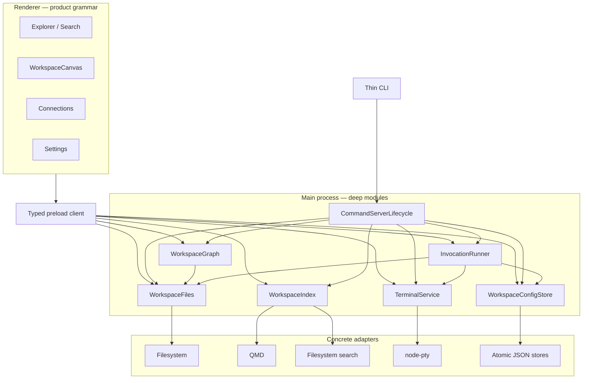
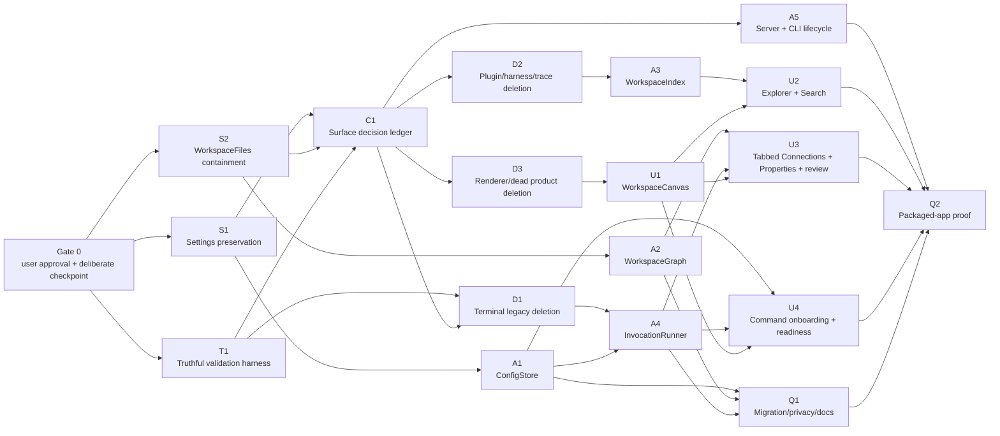

# Exo Simplification Audit and Execution Plan

Status: **historical planning corpus as of 2026-07-12.** `../tasks.md` is the active execution ledger and `../issues.md` is the active QA record. The proposals and audits below explain prior decisions; they do not describe shipped behavior or authorize restoration of removed systems.
Branch audited: `refactor/note-native-exo`
Baseline commit: `679183e`
Audit date: 2026-07-09

Shared Ashby north star: `../../../notes/shoshin-codex/ashby.md`. This file specializes that vision for Exo implementation; it does not redefine Guardian or Ash.

This is the proposed replacement for the current completion-plan stack. It combines product definition, architecture review, interface review, runtime and security findings, repository hygiene, validation truth, and the implementation fan-out into one disposable plan.

When the work lands, retain the durable decisions in the canonical product/architecture docs and ADRs, then delete this file. A plan that outlives its decision is stale code written in prose.

---

## 1. Executive ruling

Choose the aggressive simplification path.

Do **not** incrementally polish the current midpoint. It still expresses two products at once: the old harness/plugin/control-plane workspace and the new Markdown exocortex. Compatibility interfaces, dead surfaces, duplicated spatial models, and old docs are making the new product look more complex and less coherent than it is.

The target is:

> **Exo is a local, user-owned Markdown exocortex with modular, tunable search, inline agent invocation, and graph management skills.**

The product spine is deliberately small:

1. A trustworthy root-scoped Markdown workspace on ordinary files.
2. Modular Search with filesystem and QMD as the two earned implementations.
3. Actionable Connections: links, backlinks, tags, properties, relevant context, and a focused graph.
4. One pane canvas for notes, terminals, previews, graphs, and diffs.
5. Configured, provider-neutral Commands that can run user-editable graph/wiki skills.
6. Reviewable invocation outcomes and Markdown/frontmatter changes.
7. A thin CLI and token-authenticated local command server over the same deep modules.

Everything else must either make this loop materially better or leave Baseline Core.

### Execution continuity

Codex agents are already executing simplification, legacy deletion, deep-module cleanup, and UI cleanup/convergence against this plan. Continue those assigned work packages and preserve exclusive file ownership. The Folder Index direction added on 2026-07-10 clarifies the product target but is sequenced after the current graph/files/canvas/explorer owners stabilize their boundaries; it is not a reason to reset the branch, revive deleted architecture, or broaden an in-flight agent's scope.

### Immediate no-ship gates

Two defects block broad real-vault use and all large implementation fan-out:

1. **Settings data loss:** opening or closing Workspace Settings can erase configured Agent Commands and saved layout. See [EXO-ISSUE-102](../issues.md#exo-issue-102-opening-workspace-settings-can-erase-agent-commands-and-pane-layout).
2. **Workspace containment:** note paths could escape authorized Note Roots, including through clicked wikilinks, enabling reads and mutations outside the authorized workspace. See [EXO-ISSUE-103](../issues.md#exo-issue-103-note-paths-can-escape-note-roots-and-mutate-arbitrary-filesystem-locations).

No checkpoint, no fan-out. No safety fixes, no real-vault dogfooding. No settled surface, no public-contract hash refresh.

### External architecture review

The Fable architecture review approved this direction with four binding corrections:

- Treat the pre-simplification checkpoint as a hard gate, not an agent-inferred convenience.
- Preserve unknown config keys and migration evidence, not only fields known to the current dialog.
- Delete dead routes and concepts before consolidating or freezing protocols; otherwise dead architecture becomes beautifully typed.
- The final proof is a packaged app exercising the complete core loop against a copy of the real vault.

It also agreed that terminal is a specialized pane presentation, not a second application topology; no-producer trace/plugin machinery should be deleted now; and Loom/branch-family behavior should leave Baseline Core unless current use proves it belongs.

### Reference-product amendments

The deeper review in `notes/shoshin-codex/ok-explore-exo.md` sharpens the target without changing the Option B ruling.

**Borrow directly:**

- Setup as three visible outcomes—workspace, first Command, readiness/test—not a settings maze.
- One focused-note Connections surface with tabs for **Outline**, **Links**, **Graph**, and later **Activity**.
- Typed frontmatter Properties in the reading surface, with raw Markdown remaining authoritative.
- A deliberate terminal interaction contract: ordinary xterm scrollback versus mouse-mode TUI ownership.
- Per-target integration outcomes such as written, overwritten, declined, unsupported, and failed whenever Exo later writes external configuration.

**Adapt to Exo:**

- Preserve Exo's arbitrary mixed-pane canvas; unify the implementations behind it rather than reducing the product to a document editor with a terminal drawer.
- Keep direct PTY simple at its external interface while retaining proven internal safeguards: bounded renderer replay, output backpressure/coalescing, immediate visual fit plus throttled PTY resize, hidden-but-mounted terminal tabs, and renderer fallback after WebGL loss.
- Treat Claude/Codex/Pi as data-only Command templates, never terminal or harness subclasses.
- Keep CLI-first integration in V1. A future preview launcher or MCP writer is an optional reviewed adapter outside Baseline Core.

**Do not import:**

- CRDT/collaboration, sync/server architecture, broad host registries, or a rich-editor database premise.
- Implicit rewrites of shared `.claude`, MCP, or launcher files.
- Private xterm implementation dependencies without a pinned upgrade test and a public-API fallback.

---

## 2. Product truth

### 2.1 Name and ownership

- **Exo** is the product and application name.
- An **exograph** is the user-owned web of Markdown, links, properties, attachments, and derived context.
- Avoid presenting “Exo” and “Exograph” as two competing product brands.
- Tagline: **Your exocortex, in Markdown.**

The name matters because it encodes ownership: Exo is replaceable software; the exograph is durable user data.

### 2.2 Canonical loop

```text
Capture → Connect → Find → Act → Review
   note      link      search   @command   diff + provenance
```

Each baseline feature must support this loop:

- **Capture:** fast, reliable Markdown authoring and autosave.
- **Connect:** wikilinks, backlinks, tags, properties, unresolved links, and graph context.
- **Find:** files, quick switch, lexical search, semantic search, and project context.
- **Act:** an exact, human-owned `@command` mention launches a configured command with a pointer to the note.
- **Review:** the user can see what ran, what changed, how confident attribution is, and inspect the diff.

### 2.3 Baseline objects

Every persisted or visible object needs one sentence of product meaning:

| Object | Meaning | Source of truth |
|---|---|---|
| Workspace | A named set of Note Roots | User config |
| Note | Editable Markdown under a note root | Filesystem |
| Folder | A filesystem structure that gives Notes a primary home | Filesystem |
| Folder Index | Optional `index.md` describing a Folder, its properties, relationships, and organization guidance | Filesystem |
| Folder Overview | A projection of Folder Index content plus derived members, graph, and search context | Derived from filesystem/graph/index |
| Link | A Markdown relationship resolved within workspace identity rules | Derived |
| Graph | The current resolved and unresolved relationships among workspace notes | Derived, disposable |
| Search index | An acceleration structure for retrieval | Derived, disposable |
| Pane | A view of one note, terminal, preview, graph, or diff | Restorable UI state |
| Command | A provider-neutral configured executable addressed by `@handle` | Workspace config |
| Invocation | One human-authorized command run and its observed outcome | Local record with retention policy |
| Trust decision | Permission for one executable fingerprint in one workspace | App-local security state |

If an object has no honest sentence here, it should not survive merely because types and tests exist for it.

### 2.4 Baseline Core

Keep:

- Markdown files as canonical user data.
- Multiple note roots.
- Wikilinks, backlinks, tags, properties, unresolved links, and neighborhood queries.
- **Next-slice design:** Folder Overview backed by optional user-owned `index.md` Folder Indexes. It must not imply a write on viewing; creation belongs to an explicit authoring action.
- A focused-note Connections surface: event-driven Outline, lightweight Links, a lazy Graph tab, and Activity only when invocation history earns it.
- A compact typed Properties header whose edits round-trip through Markdown frontmatter; no proprietary metadata store.
- Filesystem search and QMD as the one current provider seam with two real adapters.
- Relevant-context discovery that can combine provider relevance with Exo-owned links, backlinks, tags, properties, and graph neighborhoods while explaining why each candidate appeared.
- Note, terminal, local preview, graph, and diff pane types.
- Configured Agent Commands, explicit trust, terminal-backed invocation, change observation, and diff review.
- **Next-slice design:** user-editable graph/wiki Skills expressed as instructions and data passed to configured Commands; no dynamic skill code, automatic chaining, or separate Skill Manager.
- Three-step first run: select workspace, configure/check the first Command, then inspect readiness and test it in a terminal.
- CLI search/read/graph/open/preview/terminal/spawn operations that have a real operator use.

Remove from Baseline Core:

- General plugin/capability/surface machinery without a live second implementation.
- Built-in harness identity and provider-specific runtime/launch abstractions.
- Semantic trace/activity systems with readers but no production writer.
- Durable transcript ownership and tmux compatibility concepts.
- Loom/branch-family behavior. Git already preserves history; the vault has only a tiny archived footprint. It can return as an extension after a real recurring use appears.
- Competing drawer, dock, rail, and pane topologies.
- Hidden secondary-root support, unreachable search, and any other “implemented but inaccessible” feature.

### 2.5 Explicit non-goals for this release

- A general plugin platform.
- A universal agent harness manager.
- Agent lifecycle orchestration as a product section.
- Persistent terminal history owned by Exo.
- Perfect line-level authorship attribution.
- Remote collaboration or cloud sync.
- A canvas/whiteboard clone.
- A programmable automation/routine engine.
- Automatic writes to Claude, Codex, MCP, launcher, or other host configuration.
- A native Feed, external-source synchronization system, Ashby Gym, trainer, model manager, cloud index, or general skill/plugin platform.

These are not rejected forever. They are rejected as prerequisites for a coherent Exo.

When Plugin packaging returns, it means a future installable/versioned distribution bundle for proven Skills, ontology templates, Command templates, evals, or external integrations. It does not mean restoring a general internal capability registry, arbitrary renderer code, or treating every varying implementation as a Plugin.

### 2.6 Guardian compatibility is a data contract, not a feature set

The long-term Principal Alignment vision is documented in [`exo-guardian-principal-alignment-vision.md`](../../../notes/shoshin-codex/exo-guardian-principal-alignment-vision.md). It does not authorize Guardian product surfaces in this reset.

Exo V1 should future-proof only the evidence already produced by its core loop:

- stable note/file/context references and human/agent/mixed provenance;
- immutable Command and invocation identity with model/runtime metadata;
- review outcomes such as accept, edit, reject, keep, reload, act once, or trust;
- exact diffs and first harmful/unauthorized action even if a run later recovers;
- privacy/export classification and evidence links;
- an append-only path for later correction, authorization, and outcome events without changing Markdown as the user-data authority.

Do not add a Train tab, model registry, GPU orchestration, principal dashboard, relationship manager, or autonomy cockpit. The manual `ga-pi` correction loop must first prove the `PrincipalEvent` schema and held-out lift. Dataset compilation, evals, training, and Guardian releases begin as separate CLI workflows and derived artifacts.

---

## 3. Evidence and current-state truth

### 3.1 Refactor scale

At audit time the intended pivot existed only in the working tree:

- `247` tracked files changed.
- `4,238` insertions and `39,531` deletions: net `-35,293` lines.
- `35` untracked status entries contained important new product code and plans.
- Current production/test source across desktop, core, and CLI is roughly `45k` lines.
- An obvious surviving legacy island is roughly `5.7k` production lines before tests and docs.

This is an excellent deletion result and an unsafe integration state. The first execution action must be a deliberate checkpoint after reviewing the untracked inventory and excluding generated/runtime/user data.

### 3.2 Validation truth

| Gate | Audit result | Meaning |
|---|---|---|
| `pnpm check` | Pass | Typecheck, unit tests, and builds pass: core 180, desktop 141, CLI 58, scripts 10 |
| `pnpm check:repo` | Fail | Four protected contracts changed without accepted hashes: command protocol, server routes, CLI commands, app-client methods |
| `pnpm stable:smoke -- --scenario shell-fake-claude-render` | Fail | Script targets a deleted test and reports “No tests found” |
| `pnpm test:e2e` | Common-harness failure | At interruption: 37 failed, 1 passed, 46 not run; the shared helper requires a visible `terminal-dock` that the new shell can hide |
| `git diff --check` | Pass | No whitespace errors in the pivot diff |
| Desktop build | Pass with warning | Renderer bundle is about 2.66 MB; `gray-matter` produces an eval warning |

The old completion claim in `tasks.md`—238 core, 62 CLI, 272 desktop, 100/102 E2E—is not evidence for the current tree. Validation docs and tests must report the current state, including known-red gates.

### 3.3 Live interface dogfood

The current app was exercised from source. Evidence screenshots are retained temporarily in `/tmp/exo-audit-*.png` for this audit session.

Observed:

- The main note view is calm, readable, and already close to the desired visual tone.
- Workspace Settings can open while the workspace popover remains visibly underneath; closing Settings leaves the popover open.
- Appearance and Search settings use far more surface area than their information warrants.
- Terminal settings expose tmux/transcript/read-size/coalescing/geometry/health internals after the direct-pty pivot.
- The right rail looks like section navigation, but Files reveals the left sidebar, Browser creates or mutates a pane, Terminal may create a shell, and the content region remains a terminal pane tree.
- Re-clicking Browser can replace an existing preview URL with `about:blank`.
- Browser beside Terminal can squeeze the editor into a narrow strip without a coherent responsive mode.
- The floating four-quadrant Inspector obscures content and duplicates clearer inline properties.
- The branch icon is a Loom/branch selector on ordinary notes, not graph navigation.
- The editor shows both persistent “Saved” text and a disabled Save button.
- Search is built but unreachable because `setExplorerMode` is never called.

---

## 4. Finding matrix

Severity describes user or architectural impact, not implementation difficulty.

| ID | Severity | Finding | Evidence / primary files | Required outcome |
|---|---|---|---|---|
| F-01 | Critical | Opening Settings silently drops commands and layout | `useWorkspaceSettingsController.ts:75,100,142,295`; `workspace-settings-service.ts:39`; `workspace-settings.ts:183` | Patch/revision semantics; unknown-key preservation; round-trip regression |
| F-02 | Critical | Note operations can escape authorized roots | `workspace-notes-service.ts:51,69`; `workspace.ts:535`; `workspace-ipc.ts:119`; `App.tsx:657` | Root-scoped `WorkspaceFiles`; canonical identities; traversal/symlink tests |
| F-03 | High | Launch is not transactional | `agent-command-invocation-service.ts:79,120,146`; `terminal-manager.ts:249` | One `InvocationRunner` state machine with cleanup on every partial failure |
| F-04 | High | Human/external edits can be labeled likely-agent and runs can finalize into the wrong workspace | `invocation-observation-service.ts:32,65,104,126,142` | Immutable run context, symmetric overlap, writer signals, honest ambiguity |
| F-05 | High | Product graph, core graph, renderer graph, and link resolvers disagree | `workspace-notes-service.ts:64,127`; `notes.ts:95`; `graph-snapshot.ts:159,199`; `graphAffordances.ts:90` | One authoritative `WorkspaceGraph` built on `WorkspaceFiles` identity |
| F-06 | High | Terminal tail is unbounded for output without newlines | `terminal-tail-cache.ts:64`; `terminal-manager.ts:274,363` | Character/byte-bounded ring plus line view |
| F-07 | High | Main strips valid TUI mouse-mode bytes | `terminal-manager.ts:454,549` | Byte-faithful live pty stream; clean text only in read adapter |
| F-08 | High | Command-server restart/discovery races can remove or quarantine the new instance | `command-server.ts:103,133`; `main/index.ts:104`; `app-client.ts:416` | Serialized lifecycle, atomic discovery write, generation checks |
| F-09 | High | Search is table-stakes functionality with no UI entry point | `FileTree.tsx:79,184`; `useAppKeybindings.ts` | Explorer search control, quick-switch shortcut, one result UI |
| F-10 | High | Right rail, editor split tree, terminal tree, drawers, and inspector form competing spatial models | `ShellLayout.tsx:271`; `App.tsx:1079,1134`; drawer/tool-dock files | One `WorkspaceCanvas`; one tabbed focused-note Connections surface |
| F-11 | High | Required commands cannot be configured in the app | `WorkspaceSettingsDialog.tsx:25`; `workspaceSettingsDialogTypes.ts:11` | Provider-neutral Commands settings plus workspace → first Command → readiness/test onboarding |
| F-12 | High | Project roots are persisted and loaded but invisible | `useWorkspaceTrees.ts:30`; `App.tsx:72,438` | Show as read-only Attached folders, searchable and eligible as command working folders |
| F-13 | High | A single-root workspace can lack any root-level New note action | `FileTree.tsx:233`; `ExplorerSections.tsx:128` | Explicit header actions and familiar new-note shortcut |
| F-14 | High | Current E2E/stable-smoke/task truth is stale | `tests/helpers.ts:152`; `stable-smoke.mjs:30`; `tasks.md` validation claim | Repair journeys and report actual counts before structural changes continue |
| F-15 | High | Legacy plugin/harness/run/trace/surface code is live-exported but no longer a product | `core/src/index.ts:8`; `cli/src/index.ts:383,593,703` | Delete after caller/contract inventory; do not add adapters around it |
| F-16 | High | Active docs and ADRs contradict the direct-pty, note-native product | `CONTEXT.md`; `AGENTS.md:105`; `README.md:239`; `docs/architecture.md:118`; ADR 0001 | Replace with one current truth and superseding ADRs; delete duplicated plans |
| F-17 | Medium | Editor grid can misplace the editor when invocation and properties chrome coexist | `styles.css:229`; `NoteEditor.tsx` | One chrome stack plus flexible editor surface with `min-height: 0` |
| F-18 | Medium | Tabs, resizers, dialogs, menus, icon controls, focus, and overflow miss baseline accessibility | `Chrome.tsx:69`; `PaneTree.tsx:131`; `WorkspaceSettingsDialog.tsx:46`; `shell.css:171` | Native semantics, keyboard paths, focus restoration, visible overflow |
| F-19 | Medium | Package exports, dependencies, builder inputs, and dead UI remain inconsistent | `packages/core/package.json:13`; `electron-builder.yml:13`; dead drawers/tool dock | Export-target check, dependency audit, generated-output clean command |
| F-20 | Medium | Invocation records contain prompts, paths, and diffs without an explicit retention/delete contract | `agent-invocation.ts:75`; `invocation-store.ts:27` | Visible retention, export/delete semantics, migration and cleanup documentation |
| F-21 | High | Direct PTY has no explicit ordinary-scrollback versus mouse-mode-TUI contract | terminal view/dock/input policy and E2E coverage | xterm-owned normal scrollback; visible TUI ownership; modifier escape; deterministic wheel/trackpad/selection tests |
| F-22 | Medium | Properties exist as fragmented/read-only context rather than a deliberate Markdown surface | note editor, inspector, frontmatter parsing, graph context | Typed read-first Properties header; transactional Markdown edits after graph identity is authoritative |

### What is already good

Do not flatten strong modules merely because they are large:

- `markdownLivePreview.ts` is a promising deep module: a small editor-facing interface hides legitimately complex Markdown decoration behavior.
- Markdown on disk remains the canonical data model.
- The new direct-pty implementation is the correct substrate; the stale interface around it is the problem.
- Search has two concrete implementations worth preserving: QMD and filesystem.
- Graph snapshot/query tests contain stronger resolution semantics than the production path.
- Agent Commands, trust fingerprints, invocation records, watcher fan-out, and diff artifacts are the right primitives.
- Browser URL validation and token-authenticated local command-server work are worth retaining.
- Arbitrary mixed note/terminal/preview splits are a real product differentiator; simplify their ownership without deleting the capability.
- Reduced-motion and reduced-transparency foundations already exist.
- The main note surface demonstrates good restraint; this is a semantics refactor before a visual redesign.

---

## 5. Architecture: fewer, deeper modules

The goal is not maximum file splitting. It is **depth**: a small, stable interface hiding substantial decisions. Every proposed **seam** below has either two real adapters, an authorization boundary, or an effectful state machine. That increases **leverage**, keeps change **locality**, and avoids ceremonial forwarding layers.



### 5.1 `WorkspaceConfigStore` — Strong

**Interface:** `load`, `patch(expectedRevision, patch)`, `listWorkspaces`, `switchWorkspace`, and a typed change event.

It owns config normalization, one explicit alpha migration, unknown-key preservation, serialized atomic writes, corruption reporting, backup evidence, and revision conflicts. Renderer dialogs submit owned-field patches. Do not grow this into a vague catch-all `WorkspaceState`.

This module replaces full-object renderer saves, broad `catch => null`, non-atomic writes, environment mutation hidden in settings, and a separate onboarding persistence state machine. A valid workspace config enters the app; an invalid or absent config enters setup.

### 5.2 `WorkspaceFiles` — Strong

**Interface:** root-relative identities plus `resolveLinkTarget`, `read`, `write`, `create`, `rename`, `remove`, `list`, and change subscription.

This is an authorization module, not a filesystem utility. It is constructed from allowed roots and owns canonicalization, nearest-ancestor checks for creates, realpath containment, symlink policy, collision rules, atomic writes, and note identity. No renderer, CLI route, or graph query accepts an arbitrary absolute mutation path.

### 5.3 `WorkspaceGraph` — Strong

**Interface:** `resolveLink`, `contextForNote`, `backlinks`, `linksFrom`, `unresolved`, `neighborhood`, and rebuild/invalidation status.

Build it on `WorkspaceFiles` identity. Reuse the strongest snapshot/query semantics, then delete `NoteKnowledge`, basename-first resolution, renderer-fabricated snapshots, and duplicate graph models. Derived graph state is disposable and rebuildable.

Folder identity belongs here as path-derived graph structure. A Folder Index contributes user-owned title, description, properties, links, and typed relationships; Folder membership contributes derived containment edges. The nearest Folder Index chain may supply inherited ontology/search/Skill guidance, but Exo must not rewrite child Notes merely to materialize inheritance.

### 5.4 `WorkspaceIndex` — Strong

**Interface:** `search(query, options)`, `status`, `rebuild`, and explicit provider selection/fallback state.

This is the only current provider seam because it has two real adapters: QMD and filesystem search. Construct it with workspace context once; do not repeat `(model, runtimeRoot)` through shallow facades. Fallback must be visible, and results must report truncation/visited information rather than silently stopping at hidden limits.

### 5.5 `TerminalService` — Strong

**Interface:** `create`, `write`, `resize`, `readTail`, `kill`, `onData`, and `onExit`.

There is one production adapter: direct `node-pty`. A fake exists for deterministic tests. Delete the tmux-shaped runtime abstraction, attach/restore/session-option stubs, transcript lifecycle, **input** coalescing fiction, mouse-byte sanitizer, and user settings that do not affect behavior. Keep a byte-bounded in-memory replay/tail for renderer reload and operator reads; xterm owns the live screen and scrollback.

The external interface remains byte-faithful and small. Proven polish belongs inside the implementation: renderer-delivery acknowledgements and bounded **output** coalescing for backpressure, immediate xterm fit plus throttled PTY resize, terminals remaining mounted when their tab is hidden, and DOM/canvas fallback if the WebGL renderer is lost. None of these become user settings or alternate terminal runtimes.

The interaction contract is explicit:

- Ordinary shell output uses native xterm selection, wheel/trackpad momentum, and local scrollback. No shell/layout parent captures those events.
- A full-screen app that requests mouse reports may own the wheel. Exo shows a compact “App controls scroll” indicator and documents one modifier gesture for inspecting local scrollback.
- App exit ends the PTY. Renderer reload may replay the bounded buffer, but Exo does not imply durable process persistence; users may choose tmux or provider-native resume inside the shell.
- Any reliance on private xterm internals requires a pinned upgrade regression and a public-API fallback.

### 5.6 `InvocationRunner` — Strong

**Interface:** `prepare`, `authorizeAndStart`, `endObservation`, `get`, and `review`.

It owns the transaction:

```text
allocate id
→ capture immutable workspace + pre-snapshot
→ persist pending
→ subscribe to lifecycle and file writers
→ spawn
→ require prompt delivery
→ mark running
→ settle and finalize
→ persist changed files, attribution, and review refs
```

Every error path must either kill/clean up or record a terminal failure. Overlap marks all participants; human writes are explicit; unknown writers remain ambiguous. This module hides trust, terminal, observation, store, and diff ordering from UI and CLI callers.

### 5.7 `CommandServerLifecycle` and thin adapters — Strong

**Interface:** `start`, `stop`, `restart`, and `status`.

It serializes lifecycle operations, writes discovery with temp-plus-rename, uses an instance generation, and removes/quarantines only the generation it inspected. The CLI and preload are adapters over domain operations, not alternate business-logic implementations.

Do protocol consolidation only after route deletion. One lead owns the route map, CLI command vocabulary, app-client methods, and protected hashes.

### 5.8 `WorkspaceCanvas` — Strong

**Interface:** typed pane tree with `open`, `focus`, `split`, `move`, `close`, `replace`, and layout persistence.

Pane kinds are Note, Terminal, Preview, Graph, and Diff. Terminal can specialize keyboard capture, lifecycle badges, and rendering without earning a second pane graph. Exactly one pane is focused. Explorer and Connections are shell furniture, not pane competitors.

Protect the current arbitrary mixed-split capability—it is a real Exo differentiator. Simplification means one owner and one interface, not removing user-arranged note/terminal/preview layouts. Terminal tabs stay mounted while hidden so switching views does not destroy xterm state; inactive ordinary note/preview panes may use cheaper lifecycle policies.

`App.tsx` becomes composition, not a 1,400-line business-logic owner. `NoteEditor` becomes an authoring view, not the place invocation selection, global graph context, save conflict, properties, and pane orchestration converge.

### 5.9 `Connections` and document chrome — Strong

**Interface:** focused `NoteId`, document version/outline events, authoritative `WorkspaceGraph` queries, and optional invocation activity.

The renderer module owns four tabs:

- **Outline:** lightweight, event-driven from document updates, tracks the current heading, and navigates within the focused editor.
- **Links:** Linked from, Links to, Unresolved, External links, and Tags from `WorkspaceGraph`.
- **Graph:** lazy-loaded only when selected; opens a full Graph pane for deeper exploration.
- **Activity:** absent until a note has meaningful invocation history; then summarizes runs and opens Diff panes.

Properties are not another Connections tab. They remain compact document chrome above the editor. Start with typed read-only rendering; after `WorkspaceGraph` and Markdown identity are authoritative, add transactional controls for dates, tags, booleans, text, ordering, and new fields. Raw frontmatter remains the source of truth, and save → reparse → graph update is one tested path.

---

## 6. Design it twice

### 6.1 Architecture options

#### Option A — repair the current midpoint

Keep terminal and editor pane graphs, retain legacy exports until later, patch the rail semantics, update old adapters, and refresh public-contract hashes incrementally.

Benefits: smaller immediate diffs.
Costs: duplicated topology remains; compatibility becomes permanent; tests continue encoding deleted concepts; every new feature pays coordination tax.

#### Option B — delete, then deepen

Checkpoint, fix safety/truth, delete dead concepts and routes, then rebuild the surviving behavior around the modules above and one shell grammar.

Benefits: one product model, fewer public contracts, high locality, smaller cognitive surface, honest tests/docs.
Costs: demands disciplined sequencing and exclusive ownership of high-churn files.

**Decision: Option B.** The refactor has already paid most deletion cost. Stopping at the midpoint would preserve the liabilities without earning the simplicity.

### 6.2 Terminal topology options

1. **Separate terminal workspace:** preserves monitor-style density but creates a second navigation and layout model.
2. **Terminal as pane type:** one spatial grammar; terminal-specific behavior lives inside the pane adapter.

**Decision: terminal as pane type.** Monitor mode, if it survives real use, is a saved canvas layout or command—not a different application architecture.

### 6.3 Extension options

1. **General plugin platform now:** speculative capabilities, manifests, permissions, surfaces, and adapters.
2. **Concrete seams only:** keep Search because QMD/filesystem are real; add another seam only when a second implementation exists and earns it.

**Decision: concrete seams only.** A deleted plugin platform can be recovered from Git. A surviving speculative platform taxes every current change.

---

## 7. Interface specification

### 7.1 Spatial grammar

```text
┌──────── Explorer ────────┬──────────── WorkspaceCanvas ─────────────┬── Connections ──┐
│ Files / Search           │ tabs + arbitrary mixed splits:           │ focused note only│
│ Notes                    │ Note / Terminal / Preview / Graph / Diff │ Outline · Links  │
│ Attached folders         │ exactly one focused pane                 │ Graph · Activity │
│ + note  + folder         │ typed Properties live with each note     │ tabbed, not stacked│
└──────────────────────────┴──────────────────────────────────────────┴───────────────────┘
```

- **Explorer:** Notes, Attached folders, Search, New note, New folder.
- **Folder Overview:** double-clicking a Folder opens its Folder Index content when present plus derived children, properties, local graph, and relevant context. `index.md` is hidden only as a redundant Explorer row and remains revealable/editable Markdown.
- **Canvas:** the only pane tree.
- **Connections:** one contextual surface tied to the focused note; tabs switch among Outline, Links, lazy Graph, and earned Activity without losing the reading position.
- **Properties:** compact typed document chrome, separate from Connections, with Markdown frontmatter as authority.
- **Invocation:** a flow from exact mention → one confirmation sheet → optional terminal reveal → compact activity bar → diff pane.
- **Settings:** outcomes and identity, with internals under a deliberate Diagnostics disclosure.
- **Onboarding:** workspace → first Command → readiness card and Test in terminal.

### 7.2 Before / after

| Before | After | Why |
|---|---|---|
| Search exists behind unreachable state | Explorer Search button plus Cmd/Ctrl+P | Core retrieval must be discoverable |
| Project roots persist invisibly | Visible read-only Attached folders for search, command cwd, and diff review | Every stored object has one clear product meaning |
| Separate editor and terminal pane systems | One typed WorkspaceCanvas | One spatial model is easier to learn and maintain |
| Files/Browser/Terminal look selected but mutate unrelated state | Explicit pane creation/open actions | Selection styling must tell the truth |
| Inspector is repeated and can describe the wrong split | One focused-note tabbed Connections surface: Outline, Links, Graph, Activity | Removes duplication while keeping context navigable |
| Chip list is called a neighborhood graph | Honest connection list plus a real Graph pane | Names describe actual behavior |
| Properties are fragmented inspector/read-only data | Typed Properties header that round-trips through frontmatter | Structured notes without a proprietary database |
| Header Send runs the first enabled mention | Run action owned by the exact mention | The command target is unambiguous |
| Two native confirmation dialogs | One designed confirmation sheet | One safety decision, clear focus, consistent language |
| Completion says files changed but offers no review | Activity bar opens per-file Diff panes | Completes the act → review contract |
| Duplicate title, permanent Saved label, disabled Save | One identity location; only Unsaved/Saving/Error status | Routine success is silent |
| Eleven terminal implementation settings | Font size and user-facing scrollback with an explicit unit; Diagnostics only when actionable | Settings express outcomes, not implementation |
| Wheel behavior is implicit and every scroll bug looks like terminal failure | Native scrollback for ordinary shells; visible mouse-mode-TUI ownership plus a modifier escape | Makes terminal behavior predictable without reviving tmux complexity |
| First run exposes broad setup concepts but no usable command | Workspace → first Command → readiness/test | Setup ends in a working outcome |
| Viewport-sized drawers inside narrow splits | Container-aware clamped surfaces | Prevents clipping and overlap |
| Div tabs and pointer-only resizers | Semantic tabs and keyboard-operable separators | Baseline accessibility |
| Globally hidden scrollbars | Discoverable native/overlay overflow | Content must advertise that it continues |
| Raw `×` mixed with Lucide | One icon family and hit-area rule | Visual and interaction consistency |
| Loom/branch icon on every note | Removed from Baseline Core | History is not a universal primary action |

### 7.3 Language

- **Note**: Markdown under a note root.
- **File**: another file under an attached folder.
- **Folder** in normal UI; **root** only in advanced settings/CLI.
- **Connections**, not Inspector.
- **Outline**, **Links**, **Graph**, and **Activity** are tabs within Connections.
- **Linked from**, **Links to**, **Unresolved**, **External links**, **Tags**.
- **Properties** means frontmatter rendered as document chrome, never an app-only metadata store.
- **Command** in normal UI; `AgentCommand` is an internal type.
- **Run** and **Changes** in UI; Invocation is an internal/diagnostic noun.
- Never expose QMD fingerprints, coalescing, hydration buffers, geometry convergence, read caps, or health thresholds as ordinary settings.

### 7.4 Icons, spacing, and type

- One Lucide family at 14–16 px.
- Icon-only controls always have a tooltip, accessible name, and at least a 28–32 px target.
- Selected appearance means navigation or persistent state. Creation uses plus or a verb.
- Words remain for identity, destructive actions, safety decisions, errors, and meaningful status.
- 4 px spacing rhythm; 6–8 px icon/text gap; 36–40 px primary bars; 28–32 px explorer rows.
- Reading measure near 780–820 px; pane gutter `clamp(20px, 4vw, 48px)`.
- System UI/SF typography unless a custom face becomes an intentional identity asset.

### 7.5 Responsive invariants

- Explorer: approximately 160–320 px.
- Connections/auxiliary surface: approximately 320–560 px and no more than about 42% of its host.
- Below a comfortable desktop threshold, show only one auxiliary surface at a time.
- Do not squeeze the editor below approximately 520 px without switching layout mode.
- Popovers and drawers size against their containing pane, not `vw`.
- Toolbar actions have explicit priority and overflow; nothing silently disappears.
- Editor content remains flexible with `min-width: 0` and `min-height: 0`; no overlap is an invariant, not a screenshot hope.

### 7.6 Motion

- Keyboard actions, search, pane focus, terminal input, and frequent navigation are instant.
- Press feedback is immediate and subtle.
- Occasional drawers/sheets may use short spatial transitions, interruptible when possible.
- Respect reduced motion and reduced transparency; add increased-contrast support.
- No animation exists merely to announce implementation work.

### 7.7 Accessibility acceptance

- Native buttons and inputs wherever possible.
- Correct tablist/tab/tabpanel, dialog, menu, separator, tooltip, and live-status semantics.
- Enter/Space activation, arrow navigation where conventional, keyboard resizers, Escape behavior, focus trap, focus restoration.
- Visible focus rings and discoverable overflow.
- Every icon-only control is named by the accessibility tree.
- 200% zoom and 800/1024/1440 px layouts remain usable.

### 7.8 Onboarding and Command readiness

First run has three steps and one success condition: the user can write a note and run a Command.

1. **Workspace:** choose/name note roots and show Attached folders separately.
2. **First Command:** choose a data-only template or enter a custom handle, label, executable/arguments, cwd policy, environment allowlist, pointer-prompt policy, and displayed requirements.
3. **Readiness:** show executable detection, resolved cwd, discovered instruction files, trust scope, and a **Test in terminal** action with per-check outcomes.

Claude, Codex, and Pi templates populate data; they do not select a terminal subclass or provider launch path. Readiness results are discrete and inspectable—ready, declined, unsupported, or failed with repair guidance—rather than a single optimistic success banner.

---

## 8. Data, safety, migration, and retention

### 8.1 Data ownership

- Markdown and attachments are user data and never silently migrated, moved, or deleted.
- Graph/index/cache data are derived and may be rebuilt.
- Layout and workspace config are user settings; writes are atomic and lossless.
- Trust is app-local and keyed to executable fingerprint plus workspace identity.
- Invocation records contain sensitive prompts, command, working directory, changed paths, and diffs. They need visible retention and explicit delete/export behavior.
- Principal evidence events—choices, corrections, authorization decisions, and outcomes—are user data. Training datasets, preference pairs, eval packets, and adapters are derived artifacts with lineage back to that evidence.
- Live terminal tails are bounded memory, not durable user data.
- Renderer reload may replay bounded terminal memory; desktop-process exit ends the PTY. The UI and docs must state this plainly.

### 8.2 Required migration

One explicit alpha migration must cover the last shipped settings shape. It must:

1. Read and validate without mutation.
2. Create recoverable backup evidence.
3. Transform once with a recorded schema version.
4. Preserve unknown keys.
5. Write atomically.
6. Fail closed with a useful recovery path.

Do not accumulate a fallback ladder. Older unsupported shapes should produce an honest recovery message and documentation.

### 8.3 Removed-state disposition

Before deleting code, document but do not automatically delete:

- old `.exo/terminal-sessions` and transcript directories;
- plugin/profile/routine state;
- installed MCP configuration from prior versions;
- semantic trace stores;
- invocation records from the current alpha.

Provide an inspect-and-remove operator command or manual guide. Never let a repository cleanup command traverse user workspace `.exo` state.

---

## 9. Final public surface

### 9.1 CLI

Recommended V1 vocabulary:

```text
exo start | status
exo doctor
exo workspace list | use
exo search <query>
exo read <note>
exo graph <note>
exo open <note>
exo preview <target>
exo terminal list | new | read | send | stop
exo spawn @handle <task>
exo config show | edit
```

Consolidate or delete:

- duplicate top-level versus `workspace`/`notes` search/read forms;
- explicit index CRUD that search can own;
- `agents`, `runtime`, legacy `launch`, `traces`, and transcript commands;
- provider-specific flags that Agent Command config should own.

Every retained command needs one current human/operator journey, help text, an app-off behavior contract, and a deterministic test.

`exo doctor` is the V1 integration surface: executable readiness, workspace/index health, command requirements, and manual connection instructions. It diagnoses; it does not rewrite mixed user-owned configuration.

### 9.2 Command server and preload

- Thin, token-authenticated, local only.
- One route/result vocabulary shared conceptually with CLI, without forcing IPC and HTTP to be the same transport abstraction.
- No mutation accepts an unscoped arbitrary path.
- Discovery writes are atomic and generation-checked.
- Public-contract hashes update once, after route deletion and review.

### 9.3 Future reviewed integrations

Do not build an integration registry in this reset. When a specific preview launcher earns demand:

1. Show scope—project, user, or both—destination, exact diff, permissions/consequences, and remove/repair behavior.
2. Mark only Exo-owned entries; preserve unrelated content.
3. Use dry-run, explicit confirmation, atomic write, backup, remove, and doctor flows.
4. Return a per-target result: `written`, `overwritten`, `declined`, `skipped-unsupported`, or `failed` with a reason.
5. Never make the integration a prerequisite for terminal or Command launch.

The first writer is a concrete module, not proof of a general seam. Extract a provider adapter interface only when a second real writer appears and the shared behavior is proven.

---

## 10. Execution dependency graph



---

## 11. Implementation waves and work packages

At most three implementation agents run beside the lead. Every agent receives one bounded work package, an exclusive file list, explicit forbidden files, acceptance tests, and a requirement to report unexpected callers instead of adding compatibility fallbacks.

### Gate 0 — lead only: establish the recoverable truth

No subagents.

1. Confirm the user has explicitly started the goal.
2. Review all tracked and untracked pivot files; exclude generated output, runtime state, and user data.
3. Record `git status`, `git diff --stat`, current gate results, and known-red reasons.
4. Create a deliberate WIP checkpoint on the current branch or a named safety branch.
5. Reconfirm the checkpoint contains exactly the intended pivot and can be restored.

Exit: clean, named checkpoint; no lost files; known-red baseline recorded. An agent may never infer permission to create this commit.

### Wave 1 — safety and truth

#### S1 — Settings preservation and `WorkspaceConfigStore` foundation

- **Exclusive owner:** settings controller, dialog draft conversion, main settings service, core settings persistence, focused tests.
- **Deliver:** pure owned-field patch conversion; main-owned merge/revision; atomic write; explicit load errors; unknown-key and layout/command preservation.
- **Do not:** redesign Settings UI or delete terminal fields in this package.
- **Acceptance:** open/wait/close/reopen no-op round trip; partial edits preserve non-rendered/future fields; concurrent stale revision rejected; seeded command still invokes.

#### S2 — Root-scoped `WorkspaceFiles`

- **Exclusive owner:** workspace notes service, filesystem mutation core, relevant IPC/command-server note routes, containment tests.
- **Deliver:** root-relative identities; traversal, symlink, nearest-ancestor, rename, and recursive-delete containment.
- **Do not:** migrate graph semantics yet.
- **Acceptance:** all `EXO-ISSUE-103` cases fail closed; normal note/wikilink creation works across multiple roots.

#### T1 — Validation truth repair

- **Exclusive owner:** Playwright shared helpers, stable-smoke script/tests, current task validation statements.
- **Deliver:** journey-scoped setup that does not require Terminal for unrelated flows; smoke points to a live test; known skips explicit; current counts generated/reported honestly.
- **Do not:** update protected contract hashes.
- **Acceptance:** stable smoke executes a real scenario; representative note/search/settings/terminal journeys can run independently.

#### Lead C1 — intended public surface ledger

While agents work, the lead inventories every live CLI command, server route, preload method, protocol type, and external script caller. The lead records keep/delete/rename decisions. No shared protocol edit and no hash acceptance yet.

Wave-1 barrier:

- Settings and containment regressions green.
- Stable smoke meaningful.
- E2E failures classified by product journey rather than common fixture collapse.
- Intended public surface accepted.

### Wave 2 — delete before deepening

#### D1 — direct-pty terminal deletion pass

- Delete tmux-shaped runtime methods, restore/attach/session stubs, transcript lifecycle, unused harness/readiness/geometry/coalescing settings, mouse sanitizer, and false docs/tests.
- Replace line-count tail with a byte/character-bounded replay ring for renderer reload and operator reads.
- Keep only direct pty plus deterministic fake; input remains byte-faithful while bounded renderer-output coalescing/backpressure stays an internal implementation detail.
- Implement and document ordinary xterm scrollback versus mouse-mode-TUI ownership, including a visible indicator and modifier gesture.
- Preserve immediate visual fit plus throttled PTY resize, hidden-but-mounted terminal tabs, and renderer fallback after WebGL loss without exposing them as user settings.
- Acceptance: byte-faithful space/paste/Enter/Ctrl-C/mouse mode; ordinary wheel/trackpad/selection/wrapped-line scrollback; alternate-screen TUI behavior and modifier escape; resize; pane/tab move; renderer reload replay; WebGL-loss fallback; bounded long no-newline output; terminal read/send/stop; honest app-exit lifetime copy.

#### D2 — core legacy island deletion

- Delete generic plugin inventory/state/settings/permissions/capabilities/surface policy, built-in harness registry/runtime/launch, run/trace collectors/stores, and instruction overlay code after final caller proof.
- Remove barrel exports, stale package exports, manifests/templates, direct dependencies, and tests whose only purpose is the deleted product.
- Search adapters survive outside the plugin system.
- Acceptance: no production import, CLI command, package export, builder input, or doc promises the deleted systems.

#### D3 — renderer product residue deletion

- Delete dead drawers, tool dock/rail, duplicate search result component, stale Markdown preview, obsolete assets/CSS/selectors, Loom UI/core integration, and absence-only tests.
- Remove duplicate saved state and branch icon.
- Do not perform the canvas rewrite yet.
- Acceptance: renderer typecheck/tests/build; no dangling CSS/test ids/imports; one honest current shell remains.

#### Lead contract deletion/convergence

The lead alone edits `command-protocol.ts`, `shared/api.ts`, preload route definitions, CLI command registry, app-client methods, command-server route table, and protected hashes. First delete routes. Then consolidate names. Then review and accept hashes once.

Wave-2 barrier: deleted concepts absent from production, tests, package exports, CLI help, settings, builder inputs, and active docs.

### Wave 3 — deepen the surviving modules

#### A1 — complete `WorkspaceConfigStore`

Finish registry/switching/onboarding collapse, schema migration, corruption UI, and config events after S1.

#### A2 — authoritative `WorkspaceGraph`

After S2, migrate desktop context/backlinks/resolution to core snapshot/query semantics; fix cross-root identity collision; delete `NoteKnowledge` and renderer snapshot fabrication.

#### A3 — real `WorkspaceIndex`

Construct provider once per workspace; make filesystem/QMD selection and degradation explicit; return truncation metadata; remove global registry/pass-through facade.

#### A4 — transactional `InvocationRunner`

After A1 and D1, own lifecycle ordering, immutable workspace/store capture, prompt delivery, partial failure cleanup, overlap, writer attribution, settling, retention, and review references.

Required tests: instant exit, prompt rejection, spawn/store/observer failure, workspace switch mid-run, overlapping runs, human edit, unknown edit, dirty buffer, never-exiting command, restart/orphan recovery.

#### A5 — `CommandServerLifecycle` and final CLI adapter

Serialize restart; atomic generation-tagged discovery; generation-safe quarantine/removal; validate absolute cwd or resolve relative CLI cwd at the caller boundary; implement the accepted minimal command vocabulary.

Wave-3 barrier: each deep module has a narrow interface, no alternate production implementation of its decisions, and focused fault-injection tests.

### Wave 4 — one interface grammar

This wave is deliberately serialized around high-churn shell files.

#### U1 — Canvas owner

One agent exclusively owns `App.tsx`, `ShellLayout`, `PaneTree`, pane types, layout persistence adapter, and shell structural CSS.

- Replace competing editor/terminal/right-surface topology with `WorkspaceCanvas`.
- Make Terminal and Preview explicit pane types.
- Preserve arbitrary user-arranged mixed splits and make the split action discoverable.
- Keep hidden terminal tabs mounted so xterm screen/scrollback survives view switching.
- Establish focused-pane identity and container-responsive invariants.
- Remove the right section rail.

No other agent edits these files until U1 merges.

#### U2 — Explorer/Search owner

Can prepare `FileTree`, `ExplorerSections`, search UI, ranking/result components, and keybindings against the canvas interface without editing U1-owned files. U1 performs the final composition.

Acceptance: Search and New note/folder are visible with one or many roots; Cmd/Ctrl+P works; Attached folders are readable/searchable but not mutated through note APIs; deep unloaded notes are findable; full keyboard navigation.

After the current Explorer/canvas cleanup merges, add the Folder Overview vertical slice without reopening U1 ownership: double-click opens a derived overview; existing folders work without writes; editing durable folder metadata creates `index.md`; new Exo-created folders may create it by default; raw `index.md` remains revealable; containment and inheritance are tested across nested folders.

#### U3 — Connections, Properties, and invocation-review owner

Can prepare focused-note tabbed Connections, typed Properties chrome, exact-mention Run affordance, one confirmation sheet, activity bar, diff pane, terminology, and component tests without editing U1-owned files. U1 performs final composition.

Acceptance: Outline updates from document events and tracks/navigates the active heading; Links uses authoritative graph data; Graph lazy-loads and can open a Graph pane; Activity appears only with meaningful invocation history; typed Properties round-trip through raw frontmatter after graph migration; two mentions run independently; run-once/trust/cancel/failure work by keyboard; completed invocation reviews each changed file and attribution.

#### U4 — first-run Command readiness owner

Can prepare the three-step onboarding flow and readiness result model without editing U1-owned composition files. U1 performs final composition.

Acceptance: a fresh profile can select a workspace, configure a data-only provider-neutral Command, see executable/cwd/instruction/trust checks, and use Test in terminal. Partial failures are individually explained; no MCP or host-config writer is required.

**Fable review, 2026-07-11:** readiness may inspect a saved Command or an unsaved draft without mutation; Test accepts a saved command id only and delegates to `InvocationRunner`. Test must return explicit untrusted/declined and fingerprint-drift outcomes, never persist trust, and only allow a one-shot launch after existing explicit user confirmation. `note_dir` is unsupported for CLI-context Test; instruction discovery is advisory; executable and cwd are launch gates. Cwd and launchability facts must come from shared pure derivation used by both readiness and `InvocationRunner.prepare`. A Test is an ordinary visible invocation and terminal—no hidden terminal, auto-kill, or special record subtype.

#### Craft convergence — lead plus focused reviewers

- Editor chrome and flexible layout.
- Settings information density and Command configuration.
- Accessibility semantics and focus.
- Responsive behavior at 1440, 1024, 800 px and 200% zoom.
- Light/dark, reduced motion/transparency, increased contrast.
- Icon, spacing, typography, tooltip, language, and overflow pass.
- Terminal scroll ownership indicator, modifier discoverability, trackpad feel, and renderer-loss recovery.
- One small onboarding moment that demonstrates arbitrary note/terminal/preview splits without becoming a tour.

### Wave 5 — migration, documentation, and packaged proof

#### Q1 — durable truth

- Run the alpha settings migration fixture and removed-state inventory.
- Add invocation retention/delete/export path.
- Provide old MCP/plugin/transcript/trace cleanup guidance without automatic deletion.
- Rewrite only the canonical docs listed below.
- Delete superseded plan families, obsolete ADR claims, stale tests/snapshots, and this plan after durable decisions are distilled.

#### Q2 — release proof

Run unit, repository, E2E, visual/accessibility, CLI app-off, install dry-run, and packaged-app checks. Exercise the packaged app on a copy of the real vault:

```text
onboard/open workspace
→ configure/check the first Command and Test in terminal
→ write and autosave a note
→ find it through reachable search
→ navigate Outline, inspect Links, and lazy-open Graph
→ double-click a Folder and inspect its derived overview
→ edit the Folder description, verify `index.md`, then verify nested primary-home/containment context
→ edit a typed Property and verify raw frontmatter identity
→ arrange a note, terminal, and preview in mixed splits
→ invoke @command
→ reveal terminal if desired
→ verify ordinary scrollback and mouse-mode-TUI escape
→ review changed files and diffs
→ restart and verify settings/layout/records
```

---

## 12. Fan-out operating contract

### 12.1 Concurrency

- One lead plus at most three implementation agents.
- Isolated worktrees/branches only after Gate 0.
- Review/oracle agents run in a read-only checkout, sandbox, or output-only provider mode. A prompt saying “do not edit” is not an authorization boundary.
- No agent may commit, reset, push, or otherwise change Git state without the user or lead explicitly assigning that action.
- Agents never share ownership of a high-churn file in the same wave.
- The lead integrates, runs cross-package gates, owns public contracts, and arbitrates unexpected callers.
- Architecture review occurs at safety barrier, deletion barrier, module-interface barrier, canvas structure, and final ship gate.

### 12.2 Lead-only files during convergence

- `apps/desktop/src/renderer/src/App.tsx`
- shell/pane composition contracts during U1
- `packages/core/src/command-protocol.ts`
- `apps/desktop/src/shared/api.ts`
- preload route map
- `packages/cli/src/index.ts` command registry
- `packages/cli/src/app-client.ts` route methods
- command-server public route table
- `scripts/check-repo.mjs` protected hashes
- canonical task/issue/status closure

Agents may inspect these files and report required changes; they do not edit them without explicit reassignment.

### 12.3 Required agent brief

Every work package prompt includes:

1. The exact objective and non-goals.
2. Dependency commit(s).
3. Owned and forbidden files.
4. Interfaces that may be consumed but not changed.
5. The failing/acceptance tests to write first.
6. Deletion expectations, including tests/docs/dependencies.
7. No hidden caps, fallback ladders, dual paths, or provider-specific hardcoding.
8. A requirement to stop and report an unexpected public caller or data migration risk.
9. Focused validation commands and final evidence format.

### 12.4 Integration order

- Rebase each package onto the latest accepted barrier before review.
- Review semantic diff, test diff, and deletion diff separately.
- Merge leaf packages before the shared composition owner.
- Run focused tests after each merge and the full barrier suite once per wave.
- Never update docs to “green” before the corresponding current-tree proof exists.

---

## 13. Ship / no-ship contract

### Start fan-out only if

- User explicitly starts the goal.
- Intended pivot is safely checkpointed.
- Untracked files are inventoried.
- Known-red baseline is recorded.
- Work packages and exclusive ownership are assigned.

### Continue past Wave 1 only if

- Settings no-op and partial-edit round trips preserve all data.
- All filesystem mutations are root-contained.
- Stable smoke is meaningful.
- E2E fixtures are journey-specific.
- Public surface keep/delete decisions are recorded.

### Enter UI convergence only if

- Dead backend/product concepts and routes are gone.
- Deep module interfaces are stable and tested.
- Graph identity is canonical.
- Invocation lifecycle and attribution are honest.
- Canvas owner has exclusive shell files.

### Ship only if

- `pnpm check:repo` passes with intentionally reviewed hashes.
- `pnpm check` passes with current counts.
- `pnpm stable:smoke` runs a live scenario.
- `pnpm terminal:check` passes after being rewritten for direct pty.
- Terminal QA proves native ordinary scrollback, mouse-mode-TUI ownership/escape, bounded reload replay, resize, mounted-tab preservation, and renderer fallback.
- `pnpm test:e2e` passes current journeys with only documented intentional skips.
- Visual/accessibility matrix passes at target sizes/preferences.
- Fresh onboarding reaches a tested first Command without MCP or provider-specific runtime code.
- Focused Connections proves event-driven Outline, authoritative Links, lazy Graph, earned Activity, and no wrong-note context across splits.
- Typed Properties preserve Markdown/frontmatter identity through edit, save, reparse, and graph refresh.
- `pnpm ci:check` passes.
- `pnpm pack:mac` succeeds and the packaged core loop passes on a real-vault copy.
- No current doc promises deleted behavior.
- No production module, export, CLI command, builder input, or setting names a deleted concept.
- User data migration/retention/cleanup paths are explicit and tested.

---

## 14. Canonical documentation after the reset

Keep only:

- `README.md` — product, setup, core loop.
- `AGENTS.md` — concise contributor invariants.
- `CONTEXT.md` — current domain vocabulary and boundaries.
- `docs/architecture.md` — current architecture, not chronology.
- `CONTRIBUTING.md` — one truthful validation workflow.
- `SECURITY.md` — current trust, filesystem, command, and data boundaries.
- `roadmap.md` — future work only.
- `tasks.md` — current work only.
- `issues.md` — open and deliberately retained issues only.
- `CHANGELOG.md` — shipped net changes.
- ADRs for the product pivot, direct pty, extension ladder, and data ownership/retention.

Delete or distill:

- the multiple completion/master/orchestration/detailed/agent-plan families;
- plugin/profile/harness architecture presented as current;
- terminal V4/tmux/transcript plans;
- implementation-history prose duplicated by Git and the ledger;
- resolved issue essays that no longer help operation;
- this audit plan after completion.

The repository should have one place to learn what Exo is, one place to learn how it works, one place to see current work, and Git for everything that happened on the way.

---

## 15. Definition of elegant enough

The reset is complete when a new engineer can answer these questions from code and current docs without archaeology:

1. What is Exo for?
2. Which files are user data, settings, derived state, and sensitive execution records?
3. Which module owns path authorization, graph identity, search selection, terminal bytes, invocation ordering, and command-server lifecycle?
4. Why does each visible surface exist?
5. What happens when Settings writes fail, a path escapes, QMD is unavailable, a command exits instantly, a human edits during a run, or the app restarts?
6. Which extension seams are real today?
7. Which exact commands prove the product works?
8. What does terminal scrolling mean in an ordinary shell versus a mouse-mode TUI, and what survives renderer reload versus app exit?

If the answer requires “legacy,” “fallback,” “for compatibility,” “future plugin,” or two conflicting docs, the work is not done.

The standard is not cleverness. It is inevitability: each object has meaning, each surface tells the truth, each module owns a decision, and nothing remains merely because deleting it feels scary.
